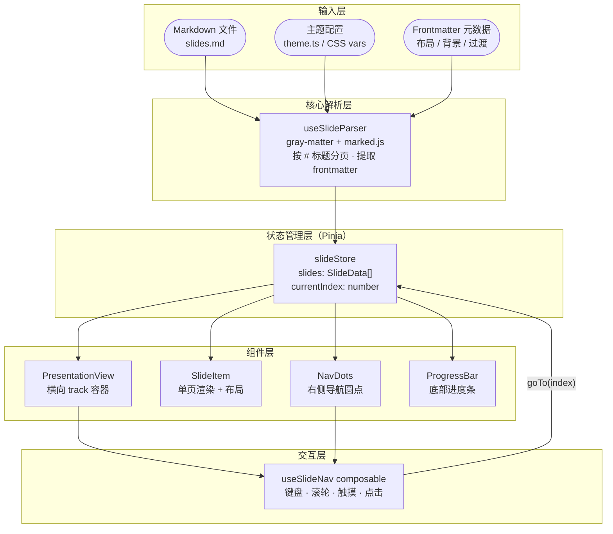
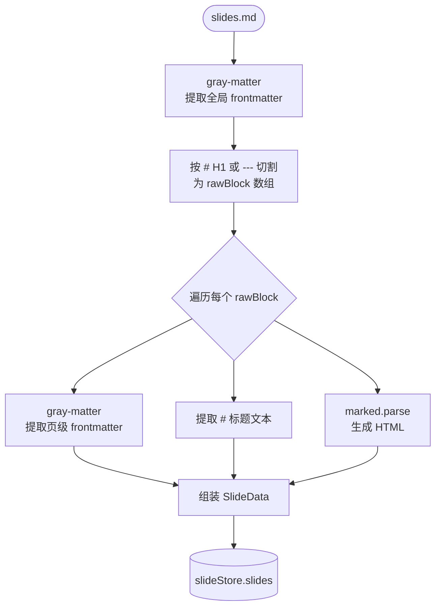

# web-ppt 方案设计文档

> 基于 Vue 3 + Markdown 实现类 PPT 演示效果
> 参考：`tmp/index.html`（横向翻页 · 导航圆点 · 底部进度条）

---

## 零、整体架构图



---

## 一、目标效果

对标 `tmp/index.html`：

- 全屏横向翻页（每页 `100vw × 100vh`）
- 右侧导航圆点 + 底部进度条
- 键盘（方向键）/ 滚轮 / 触摸滑动 切换
- 移动端降级为竖向滚动
- **内容来源改为 Markdown 文件，用标题（`#`）自动分页**

---

## 二、核心设计思路

### 2.1 Markdown 分页规则

```
# 第一页标题       ← 触发新 slide（H1）
正文内容...

# 第二页标题
> 引用块

## 子标题          ← H2 不分页，作为 slide 内部内容
```

**分隔方式可选：**

| 方案 | 说明 | 推荐度 |
|------|------|--------|
| `# H1` 标题分页 | 最自然，MD 本身有层级 | ★★★★★ |
| `---` 水平线分页 | 类似 reveal.js | ★★★★ |
| `<!-- slide -->` 注释分页 | 最灵活，但不够纯 MD | ★★★ |

**选定方案：`#` H1 作为主分页符，支持 `---` 作为备用分页符（两种都识别）。**

### 2.2 Frontmatter 元数据（每页可选）

每个 slide 块头部可以写 YAML frontmatter 控制该页的布局和行为：

```markdown
---
layout: cover      # cover | default | two-col | blank
background: #0B0D0F
transition: slide  # slide | fade | none
label: "01 / 宣言"
---

# 页面标题
```

全局 frontmatter 放在文件最顶部（第一个 `#` 之前）。

---

## 三、技术方案

### 3.1 依赖选型

| 包 | 用途 | 备注 |
|----|------|------|
| `marked` | MD → HTML | 轻量，5KB gzip |
| `gray-matter` | 解析 YAML frontmatter | 已有 TS 类型 |
| `highlight.js` | 代码块高亮（可选） | 按需引入 |

不引入 reveal.js / Slidev 等重型方案，保持轻量可控。

### 3.2 文件结构规划

```
src/
├── assets/
│   └── slides/
│       └── demo.md          # 示例演示文稿
├── components/
│   ├── PresentationView.vue  # 主容器，横向 track
│   ├── SlideItem.vue         # 单页渲染
│   ├── NavDots.vue           # 右侧导航圆点
│   └── ProgressBar.vue       # 底部进度条
├── composables/
│   ├── useSlideParser.ts     # MD 解析 → slides[]
│   └── useSlideNav.ts        # 键盘/滚轮/触摸导航
├── stores/
│   └── slideStore.ts         # Pinia：slides[], currentIndex
├── types/
│   └── slide.ts              # Slide 类型定义
└── views/
    └── PresentView.vue       # 页面入口，加载 MD 文件
```

### 3.3 核心数据结构

```typescript
// src/types/slide.ts
export interface SlideData {
  index: number
  title: string          // 从 # 标题提取
  html: string           // marked 渲染后的 HTML
  frontmatter: {
    layout?: 'cover' | 'default' | 'two-col' | 'blank'
    background?: string
    label?: string
    transition?: 'slide' | 'fade' | 'none'
    [key: string]: unknown
  }
  rawMarkdown: string
}
```

### 3.4 解析流程



### 3.5 PresentationView 核心逻辑

```vue
<!-- 与 tmp/index.html 的 #track 对应 -->
<div id="track" :style="{ transform: `translateX(-${currentIndex * 100}vw)` }">
  <SlideItem v-for="slide in slides" :key="slide.index" :slide="slide" />
</div>
```

过渡动画完全照搬 `tmp/index.html` 的 `cubic-bezier(0.77,0,0.175,1)` 曲线。

---

## 四、分阶段实施计划

### Phase 1：基础可运行（MVP）

- [ ] 安装 `marked`、`gray-matter`
- [ ] 实现 `useSlideParser`：MD → `SlideData[]`
- [ ] 实现 `slideStore`（Pinia）
- [ ] 实现 `PresentationView`：横向 track + CSS 过渡
- [ ] 实现 `SlideItem`：渲染 `v-html`
- [ ] 实现 `NavDots`：右侧圆点，点击跳转
- [ ] 实现 `ProgressBar`：底部进度条
- [ ] 实现 `useSlideNav`：键盘 + 滚轮 + 触摸
- [ ] 写 `demo.md` 示例文稿，验证分页

### Phase 2：布局系统

- [ ] 支持 frontmatter `layout` 字段
- [ ] 内置 `cover`、`default`、`two-col` 三种布局组件
- [ ] `SlideItem` 根据 `layout` 动态渲染对应布局

### Phase 3：主题与样式

- [ ] CSS 变量主题系统（对标 `tmp/index.html` 的 `:root` 变量）
- [ ] 内置 dark 主题（`--bg`、`--text`、`--accent`）
- [ ] 支持每页自定义背景色

### Phase 4：功能增强（可选）

- [ ] 代码块语法高亮（highlight.js）
- [ ] 演讲者备注（`<!-- notes: ... -->`）
- [ ] 全屏 API
- [ ] URL hash 同步（`#/3` 直接跳转第 3 页）
- [ ] 打印/导出 PDF 模式

---

## 五、关键决策记录

### Q1：为什么不用 Slidev？

Slidev 功能完整但体积大、定制成本高。本项目目标是**轻量、可控、自定义样式**，自己实现核心逻辑更灵活，也是一个很好的练手项目。

### Q2：为什么用 H1 分页而不是 `---`？

- 纯 Markdown 写法，文件本身就是结构化文档
- 可以直接在普通 MD 预览器里阅读（GitHub、VS Code 等）
- 同时支持 `---` 作为备用，兼顾偏好

### Q3：marked vs markdown-it？

`marked` 体积更小（适合浏览器直接用），API 简单。`markdown-it` 扩展性更强但稍重。当前阶段选 `marked`，后期有扩展需求可替换。

---

## 六、示例 Markdown 格式

```markdown
---
title: 我的演示
theme: dark
---

# 第一页：封面标题

这里是第一页的内容，支持 **加粗**、*斜体*、`代码`。

# 第二页：两列布局

---
layout: two-col
---

左侧内容...

---

右侧内容...

# 第三页：代码展示

```javascript
const hello = () => console.log('Hello, PPT!')
```
```

---

## 七、参考资源

- `tmp/index.html`：目标效果原型（CSS 变量、过渡动画、导航逻辑）
- [marked.js 文档](https://marked.js.org/)
- [gray-matter](https://github.com/jonschlinkert/gray-matter)
- [Slidev 源码](https://github.com/slidevjs/slidev)（参考思路，不引入）
